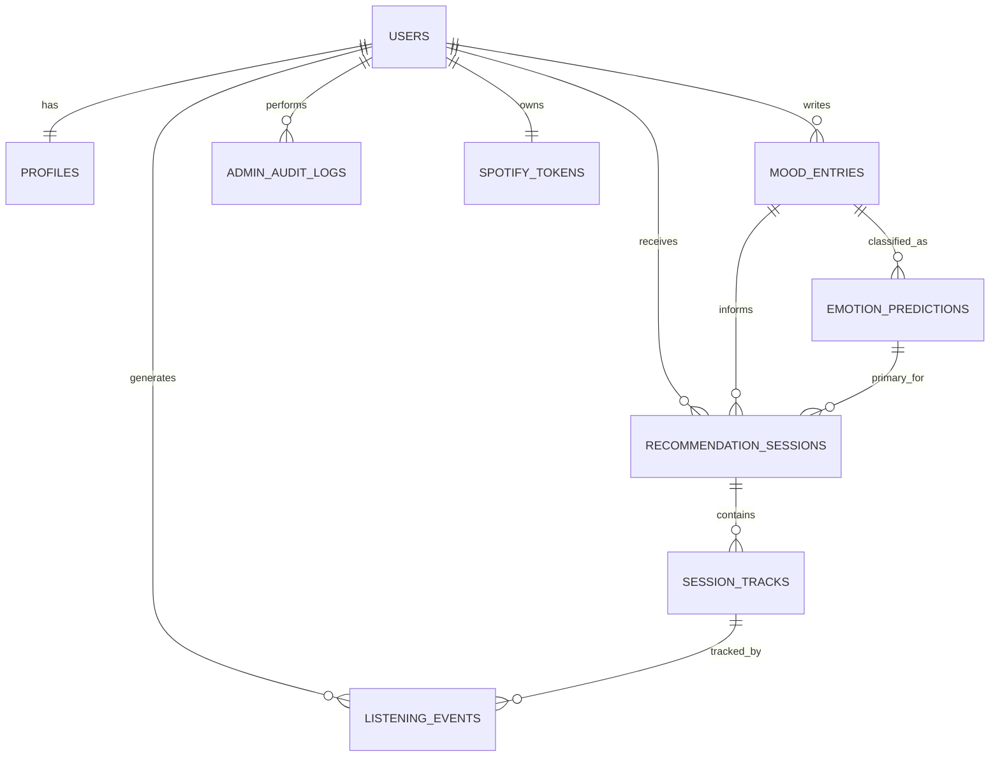

# EmoTune Database Schema

## 1. ER Diagram



## 2. MySQL DDL

```sql
SET NAMES utf8mb4;

CREATE DATABASE IF NOT EXISTS emotune
  CHARACTER SET utf8mb4
  COLLATE utf8mb4_unicode_ci;

USE emotune;

CREATE TABLE users (
  id BIGINT UNSIGNED NOT NULL AUTO_INCREMENT,
  email VARCHAR(255) NOT NULL,
  password_hash VARCHAR(255) NOT NULL,
  role ENUM('user', 'admin') NOT NULL DEFAULT 'user',
  is_active TINYINT(1) NOT NULL DEFAULT 1,
  last_login_at DATETIME NULL,
  created_at DATETIME NOT NULL DEFAULT CURRENT_TIMESTAMP,
  updated_at DATETIME NOT NULL DEFAULT CURRENT_TIMESTAMP ON UPDATE CURRENT_TIMESTAMP,
  deleted_at DATETIME NULL,
  PRIMARY KEY (id),
  UNIQUE KEY uq_users_email (email),
  KEY idx_users_role (role),
  KEY idx_users_active (is_active)
) ENGINE=InnoDB DEFAULT CHARSET=utf8mb4 COLLATE=utf8mb4_unicode_ci;

CREATE TABLE profiles (
  user_id BIGINT UNSIGNED NOT NULL,
  display_name VARCHAR(100) NOT NULL,
  preferred_language VARCHAR(8) NOT NULL DEFAULT 'en',
  timezone VARCHAR(64) NOT NULL DEFAULT 'UTC',
  avatar_url VARCHAR(512) NULL,
  favorite_artists_json JSON NULL,
  created_at DATETIME NOT NULL DEFAULT CURRENT_TIMESTAMP,
  updated_at DATETIME NOT NULL DEFAULT CURRENT_TIMESTAMP ON UPDATE CURRENT_TIMESTAMP,
  PRIMARY KEY (user_id),
  CONSTRAINT fk_profiles_user
    FOREIGN KEY (user_id) REFERENCES users(id)
    ON DELETE CASCADE
) ENGINE=InnoDB DEFAULT CHARSET=utf8mb4 COLLATE=utf8mb4_unicode_ci;

CREATE TABLE mood_entries (
  id BIGINT UNSIGNED NOT NULL AUTO_INCREMENT,
  user_id BIGINT UNSIGNED NOT NULL,
  input_text TEXT NOT NULL,
  input_language VARCHAR(8) NOT NULL DEFAULT 'en',
  entry_source ENUM('manual', 'check_in', 'imported') NOT NULL DEFAULT 'manual',
  created_at DATETIME NOT NULL DEFAULT CURRENT_TIMESTAMP,
  PRIMARY KEY (id),
  KEY idx_mood_entries_user_created (user_id, created_at),
  FULLTEXT KEY ft_mood_entries_input_text (input_text),
  CONSTRAINT fk_mood_entries_user
    FOREIGN KEY (user_id) REFERENCES users(id)
    ON DELETE CASCADE
) ENGINE=InnoDB DEFAULT CHARSET=utf8mb4 COLLATE=utf8mb4_unicode_ci;

CREATE TABLE emotion_predictions (
  id BIGINT UNSIGNED NOT NULL AUTO_INCREMENT,
  mood_entry_id BIGINT UNSIGNED NOT NULL,
  model_name VARCHAR(100) NOT NULL,
  model_version VARCHAR(32) NOT NULL,
  predicted_emotion ENUM(
    'happy',
    'sad',
    'angry',
    'stressed',
    'calm',
    'lonely',
    'romantic',
    'nostalgic',
    'motivational',
    'fearful',
    'depressing',
    'mixed'
  ) NOT NULL,
  confidence DECIMAL(5,4) NOT NULL,
  score_map_json JSON NULL,
  is_primary TINYINT(1) NOT NULL DEFAULT 1,
  created_at DATETIME NOT NULL DEFAULT CURRENT_TIMESTAMP,
  PRIMARY KEY (id),
  KEY idx_emotion_predictions_entry_primary (mood_entry_id, is_primary),
  KEY idx_emotion_predictions_emotion_created (predicted_emotion, created_at),
  CONSTRAINT chk_emotion_confidence
    CHECK (confidence >= 0.0000 AND confidence <= 1.0000),
  CONSTRAINT fk_emotion_predictions_mood_entry
    FOREIGN KEY (mood_entry_id) REFERENCES mood_entries(id)
    ON DELETE CASCADE
) ENGINE=InnoDB DEFAULT CHARSET=utf8mb4 COLLATE=utf8mb4_unicode_ci;

CREATE TABLE recommendation_sessions (
  id BIGINT UNSIGNED NOT NULL AUTO_INCREMENT,
  user_id BIGINT UNSIGNED NOT NULL,
  mood_entry_id BIGINT UNSIGNED NULL,
  primary_prediction_id BIGINT UNSIGNED NULL,
  session_status ENUM('generated', 'partially_played', 'completed', 'dismissed')
    NOT NULL DEFAULT 'generated',
  target_audio_json JSON NULL,
  generated_count SMALLINT UNSIGNED NOT NULL DEFAULT 0,
  generation_ms INT UNSIGNED NULL,
  created_at DATETIME NOT NULL DEFAULT CURRENT_TIMESTAMP,
  PRIMARY KEY (id),
  KEY idx_recommendation_sessions_user_created (user_id, created_at),
  KEY idx_recommendation_sessions_status_created (session_status, created_at),
  KEY idx_recommendation_sessions_mood (mood_entry_id),
  CONSTRAINT fk_recommendation_sessions_user
    FOREIGN KEY (user_id) REFERENCES users(id)
    ON DELETE CASCADE,
  CONSTRAINT fk_recommendation_sessions_mood_entry
    FOREIGN KEY (mood_entry_id) REFERENCES mood_entries(id)
    ON DELETE SET NULL,
  CONSTRAINT fk_recommendation_sessions_primary_prediction
    FOREIGN KEY (primary_prediction_id) REFERENCES emotion_predictions(id)
    ON DELETE SET NULL
) ENGINE=InnoDB DEFAULT CHARSET=utf8mb4 COLLATE=utf8mb4_unicode_ci;

CREATE TABLE session_tracks (
  id BIGINT UNSIGNED NOT NULL AUTO_INCREMENT,
  session_id BIGINT UNSIGNED NOT NULL,
  spotify_track_id VARCHAR(64) NOT NULL,
  track_name VARCHAR(255) NOT NULL,
  artist_name VARCHAR(255) NOT NULL,
  album_name VARCHAR(255) NULL,
  preview_url VARCHAR(512) NULL,
  image_url VARCHAR(512) NULL,
  duration_ms INT UNSIGNED NULL,
  track_position SMALLINT UNSIGNED NOT NULL,
  rank_score DECIMAL(7,6) NULL,
  valence DECIMAL(4,3) NULL,
  energy DECIMAL(4,3) NULL,
  danceability DECIMAL(4,3) NULL,
  is_played TINYINT(1) NOT NULL DEFAULT 0,
  is_liked TINYINT(1) NULL,
  created_at DATETIME NOT NULL DEFAULT CURRENT_TIMESTAMP,
  PRIMARY KEY (id),
  UNIQUE KEY uq_session_tracks_session_position (session_id, track_position),
  KEY idx_session_tracks_spotify_id (spotify_track_id),
  KEY idx_session_tracks_session_played (session_id, is_played),
  CONSTRAINT fk_session_tracks_session
    FOREIGN KEY (session_id) REFERENCES recommendation_sessions(id)
    ON DELETE CASCADE
) ENGINE=InnoDB DEFAULT CHARSET=utf8mb4 COLLATE=utf8mb4_unicode_ci;

CREATE TABLE listening_events (
  id BIGINT UNSIGNED NOT NULL AUTO_INCREMENT,
  user_id BIGINT UNSIGNED NOT NULL,
  session_track_id BIGINT UNSIGNED NULL,
  spotify_track_id VARCHAR(64) NOT NULL,
  event_type ENUM(
    'impression',
    'play',
    'pause',
    'skip',
    'like',
    'dislike',
    'complete',
    'add_to_playlist'
  ) NOT NULL,
  played_ms INT UNSIGNED NULL,
  event_value DECIMAL(10,4) NULL,
  device_type ENUM('web', 'android', 'ios', 'desktop', 'unknown')
    NOT NULL DEFAULT 'unknown',
  created_at DATETIME NOT NULL DEFAULT CURRENT_TIMESTAMP,
  PRIMARY KEY (id),
  KEY idx_listening_events_user_created (user_id, created_at),
  KEY idx_listening_events_event_created (event_type, created_at),
  KEY idx_listening_events_spotify_id (spotify_track_id),
  CONSTRAINT fk_listening_events_user
    FOREIGN KEY (user_id) REFERENCES users(id)
    ON DELETE CASCADE,
  CONSTRAINT fk_listening_events_session_track
    FOREIGN KEY (session_track_id) REFERENCES session_tracks(id)
    ON DELETE SET NULL
) ENGINE=InnoDB DEFAULT CHARSET=utf8mb4 COLLATE=utf8mb4_unicode_ci;

CREATE TABLE admin_audit_logs (
  id BIGINT UNSIGNED NOT NULL AUTO_INCREMENT,
  admin_user_id BIGINT UNSIGNED NULL,
  action VARCHAR(120) NOT NULL,
  entity_type VARCHAR(64) NOT NULL,
  entity_id VARCHAR(64) NULL,
  before_state_json JSON NULL,
  after_state_json JSON NULL,
  ip_address VARCHAR(45) NULL,
  user_agent VARCHAR(512) NULL,
  created_at DATETIME NOT NULL DEFAULT CURRENT_TIMESTAMP,
  PRIMARY KEY (id),
  KEY idx_admin_audit_logs_admin_created (admin_user_id, created_at),
  KEY idx_admin_audit_logs_entity (entity_type, entity_id),
  CONSTRAINT fk_admin_audit_logs_admin
    FOREIGN KEY (admin_user_id) REFERENCES users(id)
    ON DELETE SET NULL
) ENGINE=InnoDB DEFAULT CHARSET=utf8mb4 COLLATE=utf8mb4_unicode_ci;

CREATE TABLE spotify_tokens (
  user_id BIGINT UNSIGNED NOT NULL,
  access_token TEXT NOT NULL,
  refresh_token TEXT NULL,
  token_type VARCHAR(40) NOT NULL DEFAULT 'Bearer',
  scopes VARCHAR(255) NULL,
  expires_at DATETIME NOT NULL,
  created_at DATETIME NOT NULL DEFAULT CURRENT_TIMESTAMP,
  updated_at DATETIME NOT NULL DEFAULT CURRENT_TIMESTAMP ON UPDATE CURRENT_TIMESTAMP,
  PRIMARY KEY (user_id),
  CONSTRAINT fk_spotify_tokens_user
    FOREIGN KEY (user_id) REFERENCES users(id)
    ON DELETE CASCADE
) ENGINE=InnoDB DEFAULT CHARSET=utf8mb4 COLLATE=utf8mb4_unicode_ci;
```

## 3. Suggested Init Layout

- `database/init/001_schema.sql` -> copy the DDL above
- `database/init/002_seed_admin.sql` -> optional admin seed data

Example admin seed (replace password hash):

```sql
INSERT INTO users (email, password_hash, role)
VALUES ('admin@emotune.local', '$2b$12$replace_with_bcrypt_hash', 'admin');
```

