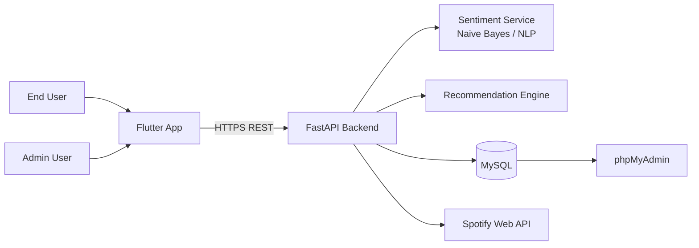
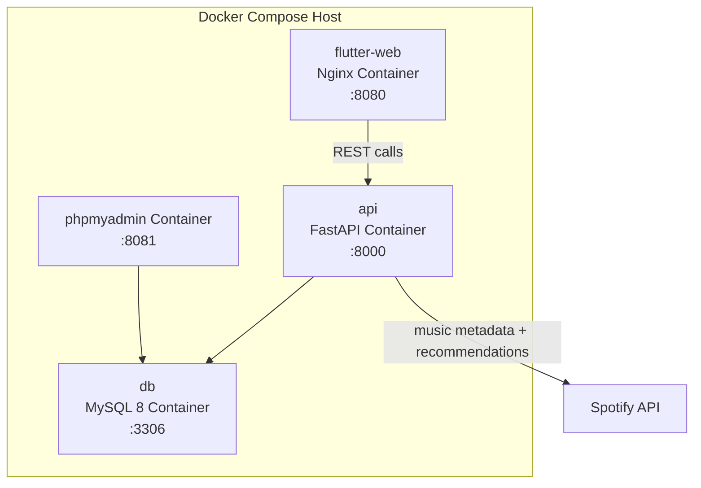
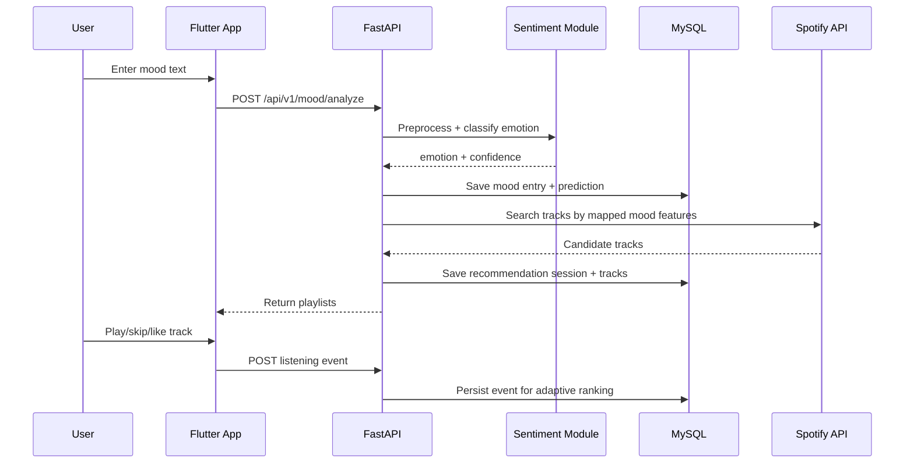

# EmoTune System Architecture

## 1. High-Level Architecture

## 2. Docker Deployment View

## 3. Recommendation Request Sequence

## 4. Core Components

### Flutter App
- Handles login, mood input, playlist rendering, playback controls, and analytics charts.
- Calls backend APIs only; no direct DB access.

### FastAPI Backend
- Auth and role checks (user/admin).
- Mood analysis orchestration.
- Spotify query and playlist ranking.
- Persists mood logs, recommendations, and listening events.

### Sentiment Module
- Text preprocessing (tokenize, normalize, clean).
- Naive Bayes inference for mood classification.
- Optional hybrid scoring (TextBlob/VADER) if enabled.

### MySQL
- Stores users, profiles, mood entries, predictions, sessions, tracks, and logs.
- Indexed for timeline queries and admin analytics.

### phpMyAdmin
- Admin SQL inspection and troubleshooting.
- Should be restricted to trusted environments.

## 5. Backend Module Boundaries

- `Auth Module`: register, login, token validation, role checks
- `Mood Module`: parse input and return emotion classification
- `Recommendation Module`: map emotion to audio targets and fetch tracks
- `History Module`: listening events and personalization signals
- `Admin Module`: usage metrics, mood distribution, user management

## 6. Security and Reliability Notes

- Enforce HTTPS in production.
- Keep Spotify and DB secrets in environment variables only.
- Use least-privilege DB accounts for API runtime.
- Add request validation, rate limiting, and API logging.
- Back up MySQL volume and monitor failed auth attempts.

